

  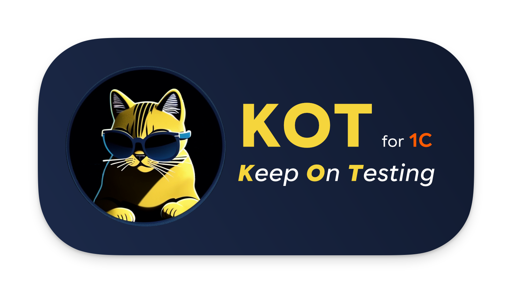 
  

**KOT** (_**K**eep **O**n **T**esting_) **for 1C** — расширение VS Code для разработки и поддержки автотестов 1С в YAML-формате (экосистема СППР / Vanessa Automation).

---

Единый рабочий контур в VS Code для QA и инженеров автоматизации 1С: написание сценариев с IntelliSense и диагностикой, сборка, запуск Vanessa Automation, исследование форм, управление тестовыми базами и ведение документации — без переключения между инструментами.

---

## Оглавление

- [Ключевые возможности](#ключевые-возможности)
- [Статус и ограничения](#статус-и-ограничения)
- [Документация по параметрам](#документация-по-параметрам)
- [Дисклеймер](#дисклеймер)
- [Благодарности](#благодарности)
- [Куда дальше](#куда-дальше)
- [Скриншоты](#скриншоты)

## Ключевые возможности

### 1) Редактор сценариев

- IntelliSense шагов Gherkin, переменных и вызовов вложенных сценариев и параметров; семантический поиск шагов по префиксу `!`.
- Предложения атрибутов открытой формы и их значений в аргументах шагов.
- Hover-подсказки по шагам, переменным, вызовам сценариев и параметрам; Gherkin-подсветка прямо внутри YAML-блока сценария.
- Диагностика неизвестных шагов и вызовов, проблем с параметрами и незакрытых блоков; предложения `Maybe you meant` и quick fix.
- Автовыравнивание Gherkin-таблиц и автозаполнение технических блоков при сохранении.
- Навигация по вызовам сценариев, поиск references и работа с `MXL`, папкой `files` и путями проекта.

→ [Подробнее](./documentation/blocks/editor-and-intellisense.md) · [Диагностика и quick fix](./documentation/blocks/diagnostics-and-quick-fix.md) · [Навигация и файлы](./documentation/blocks/navigation-and-files.md)

### 2) AI-инструменты

- Генерация описания сценария в `KOTМетаданные.Описание` — что проверяется, какой бизнес-процесс, какие развилки.
- AI-отчет по `git diff` конфигурации: что изменилось для пользователя, что проверить, какие роли и данные подготовить.
- AI-ревью измененных тестов: сравнение diff тестов с diff конфигурации и UserStory, отчет по покрытию и слепым зонам.
- Поддержка LM Studio, Ollama, OpenAI, Gemini, Azure и любого совместимого OpenAI-провайдера.

→ [Подробнее](./documentation/blocks/ai-description.md)

### 3) Менеджер тестов

- Создание главных и вложенных сценариев.
- Дерево главных сценариев с группами, чекбоксами включения/выключения и поиском.
- Статусы запуска рядом со сценариями, подсветка сценариев связанных с открытым файлом.
- Избранное с drag-and-drop в редактор для вставки вызова с параметрами.
- AI-команды и быстрые действия обслуживания доступны прямо из панели.

→ [Подробнее](./documentation/blocks/test-manager.md) · [Создание сценариев](./documentation/blocks/scenario-creation.md)

### 4) Сборка и запуск Vanessa Automation

- Сборка сценариев через `СборкаТекстовСценариев.epf` с генерацией `.feature` и `.json`.
- Запуск теста или окружения Vanessa Automation прямо из Test Manager с выбором и подготовкой тестовой базы.
- Live-подсветка шагов в `feature` во время прогона; просмотр лога в реальном времени.
- Отслеживание внешних прогонов по run-логу.

→ [Подробнее](./documentation/blocks/build-and-vanessa-run.md)

### 5) KOT Infobase Manager

- Единый список ИБ из launcher, runtime-артефактов, snapshot-ов и вручную добавленных путей.
- Создание, копирование, восстановление/выгрузка DT, обновление конфигурации, запуск в 1С или Designer.
- Эталонные базы: привязка эталонных `DT`, профилей пользователей и подготовленных баз к сценариям и встроенному запуску.
- Каталог платформ 1С, выбор платформы по умолчанию и привязка платформы к конкретной ИБ.
- Используется как общий слой выбора базы для Form Explorer и подготовки ИБ перед запуском теста.

→ [Подробнее](./documentation/blocks/infobase-manager.md) · [Эталонные базы](./documentation/blocks/etalon-bases.md) · [Platform Manager](./documentation/blocks/platform-manager.md)

### 6) KOT Form Explorer (beta)

- Панель VS Code, показывающая элементы текущей управляемой формы 1С, значения и предлагаемые шаги Vanessa Automation.
- Работает через bridge-сессию на базе `TestManager` + `TestClient`: KOT запускает рабочий клиент, снимает snapshot активной формы и отдает его в панель без установки runtime-расширения в тестируемую базу.
- Режимы `auto` (снятие состояния по интервалу) и `manual` (по клавише или кнопке).
- Тот же snapshot используется редактором для IntelliSense аргументов шагов и подстановки ссылок на атрибуты формы.

→ [Подробнее](./documentation/blocks/form-explorer.md)

### 7) Менеджер параметров

- Вкладки параметров СППР, Vanessa Automation и `GlobalVars`; профили с autosave.
- Подсветка обязательных полей, импорт/экспорт JSON, поиск по параметрам.
- Активный профиль переключается прямо из меню `Build tests` в Test Manager.

→ [Подробнее](./documentation/blocks/parameters-manager.md)

## Статус и ограничения

- Расширение активно используется и готово к реальному применению.
- Функции полной классификации/менеджмента тестов в стиле СППР реализованы частично и продолжают развиваться.
- Для сборки сценариев необходимо наличие обработки из СППР (подробнее на [ИТС](https://its.1c.ru/db/sppr2doc#content:124:hdoc)).
- Для запуска тестов необходимо наличие [Vanessa Automation](https://github.com/Pr-Mex/vanessa-automation).
- Для работы MXL-команд нужен установленный клиент [1С:Предприятие — работа с файлами](https://v8.1c.ru/static/1s-predpriyatie-rabota-s-faylami/).
- Работа расширения полноценно проверена только на Windows.
- `KOT Form Explorer` пока имеет бета-статус и может дорабатываться под пограничные случаи конкретных конфигураций.

## Документация по параметрам

- ИТС: параметры и использование обработки `СборкаТекстовСценариев`  
  [Официальный портал ИТС](https://its.1c.ru/db/sppr2doc#content:124:hdoc)
- Vanessa Automation: JSON-параметры запуска (`VAParams`)  
  [Официальная документация Vanessa Automation](https://pr-mex.github.io/vanessa-automation/dev/JsonParams/JsonParamsRU/)

## Дисклеймер

Проект не является официальным продуктом фирмы 1С и не аффилирован с ней.
Упоминания 1С/СППР/Vanessa Automation используются только для описания совместимости.

## Благодарности

- Команде тестирования 1C:Drive — за практические идеи, сценарии использования и регулярную обратную связь.
- Команде DevOps 1C:Drive — за поддержку инфраструктуры, CI/CD-практики и помощь с запуском в рабочих контурах.
- Разработчикам [Vanessa Automation](https://github.com/Pr-Mex/vanessa-automation) — за мощный инструмент автоматизации тестирования и открытую документацию.
- Всем участникам сообщества тестирования 1С.

## Куда дальше

- Быстрый старт: [`QUICK_START.md`](./documentation/QUICK_START.md)
- Подробная настройка: [`SETUP.md`](./documentation/SETUP.md)
- Документация по коду: [`DEVELOPMENT.md`](./documentation/DEVELOPMENT.md)
- Функциональные блоки: [`blocks/README.md`](./documentation/blocks/README.md)

## Скриншоты

_На скриншотах продемонстрирован интерфейс на английском языке, но русские переводы также доступны._

- [Интерфейс редактора](#интерфейс-редактора)
- [Диагностика и предложения Quick Fix](#диагностика-и-предложения-quick-fix)
- [KOT Form Explorer](#kot-form-explorer)
- [KOT Infobase Manager](#kot-infobase-manager)
- [Менеджер параметров](#менеджер-параметров)

### Интерфейс редактора
- Панель Менеджера тестов со статусами прохождения тестов и подсветкой тестов, связанных с текущим открытым файлом;
- Редактор VSCode с описанием написанного шага и описанием вложенного сценария:

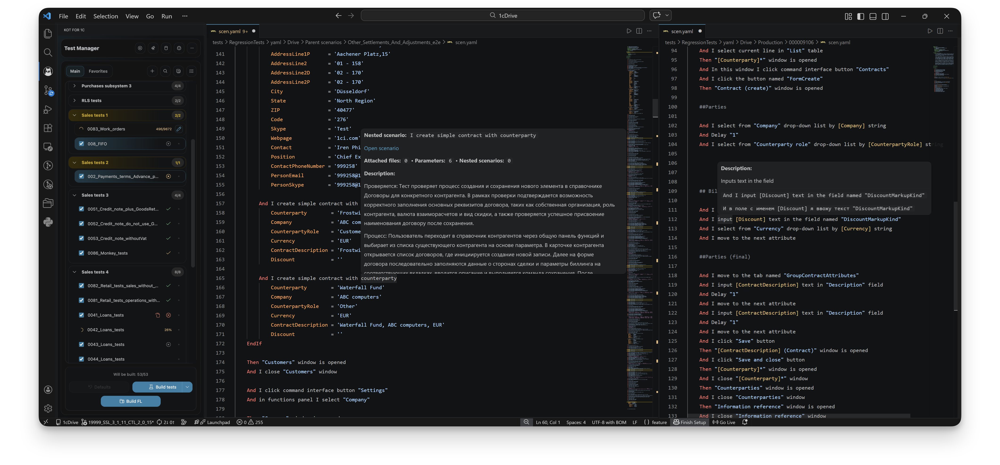

---

- AI-описание теста, созданное Gemini 2.5 Flash, а также рекомендации по улучшению теста:

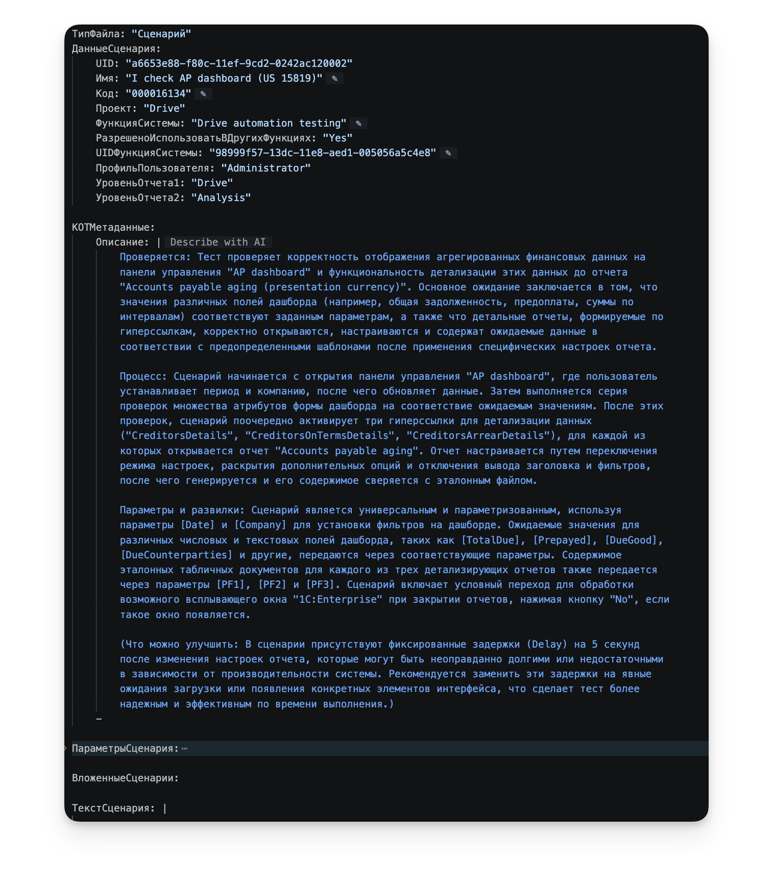

---

- Результат прохождения теста с информацией об ошибке в открытом `feature`-файле:

 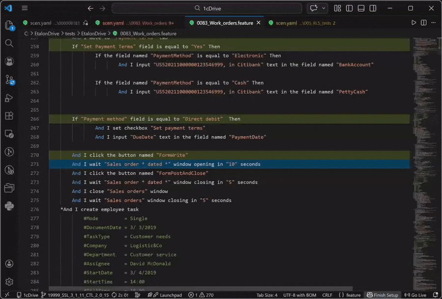

---

- Панель избранных сценариев с результатом Drag-and-drop сценария в редактор:

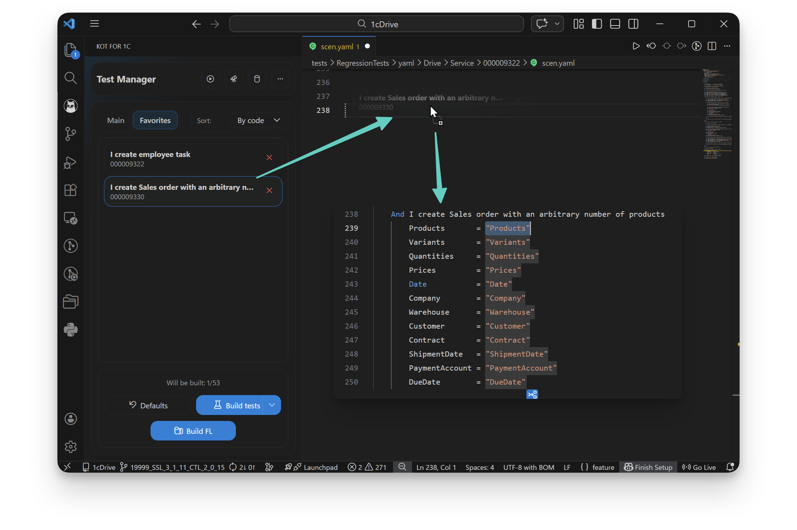

---

- Команды контекстного меню - навигация по сценариям, работа с файлами:

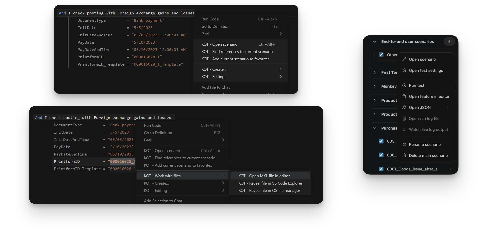

---

- IntelliSense: описание шагов, сценариев, переменных, параметров сценария, семантический поиск шагов, подсказки по текущей открытой форме.

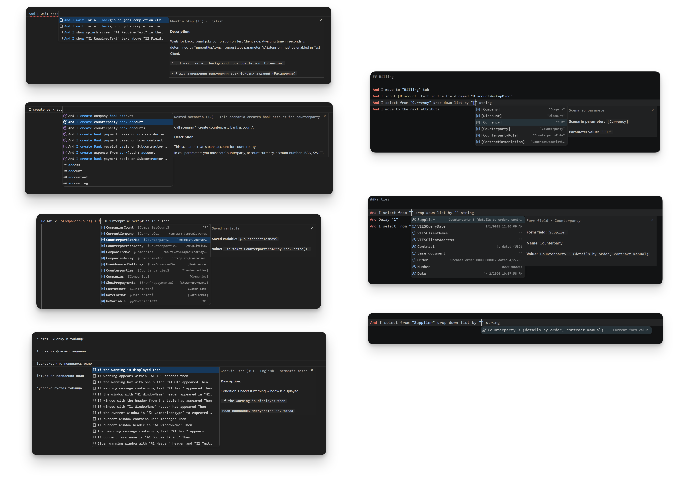

---

### Диагностика и предложения Quick Fix
- Панель Problems со списком предупреждений и ошибок;
- Хайлайт проблемных строк с описанием проблемы - неизвестный сценарий, неправильный шаг, проблемы с параметрами вложенных сценариев;
- Меню Quick fix с предложениями на замену:

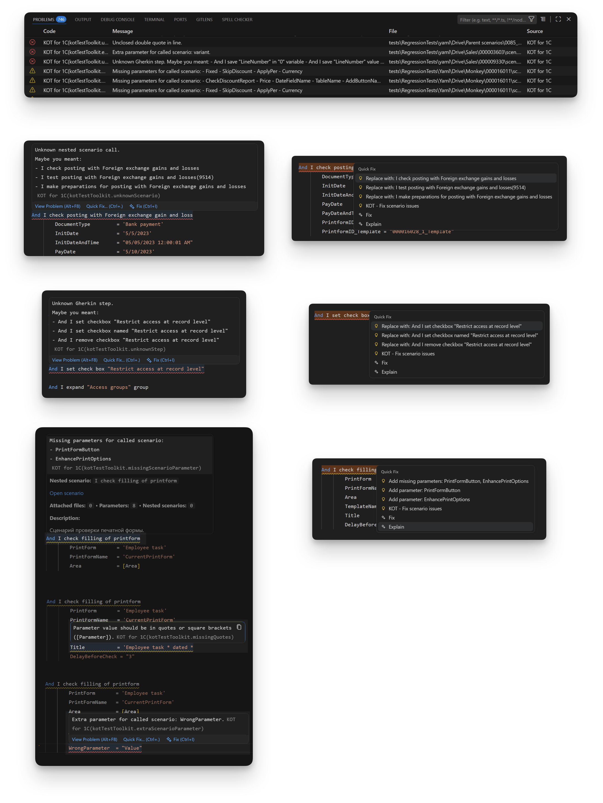

---

- Автоматическое выравнивание таблиц Gherkin и параметров сценариев:

 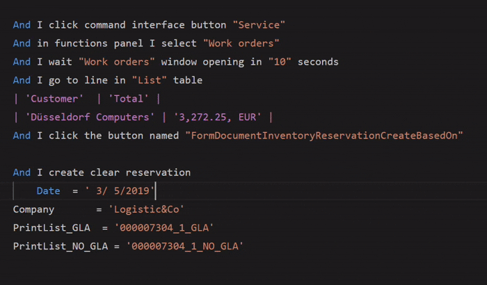

---

### KOT Form Explorer

- Интерфейс исследователя формы:

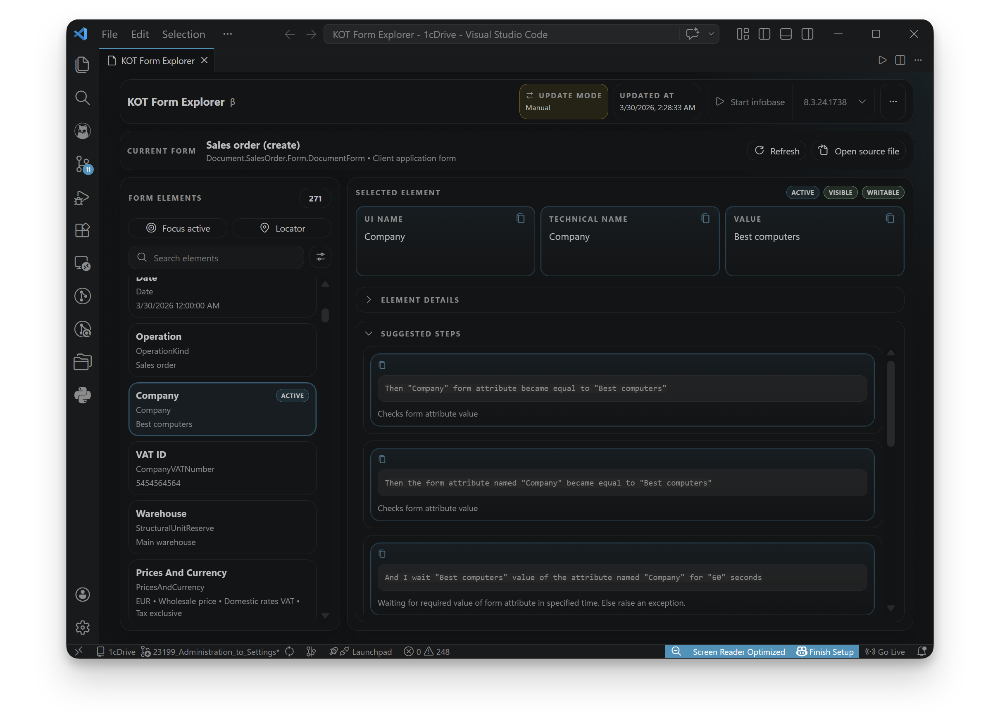

---

### KOT Infobase Manager

- Интерфейс менеджера баз - список установленных баз 1С, операции с базами:

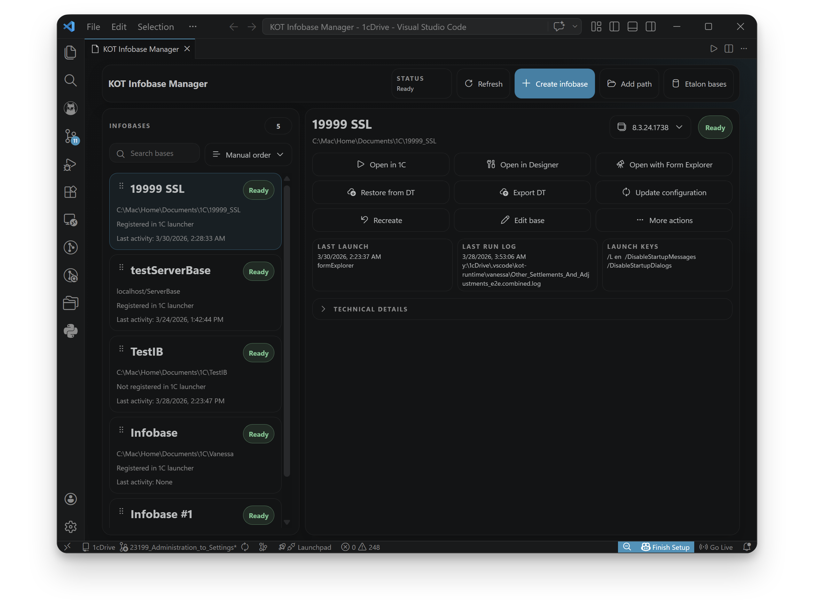

---

### Менеджер параметров

- Менеджер параметров с открытой вкладкой настроек сборки СППР и меню действий:
- Внутри менеджера KOT подсвечивает незаполненные обязательные поля для `СборкаТекстовСценариев` и предупреждает о неполном наборе параметров перед экспортом `yaml_parameters.json`.

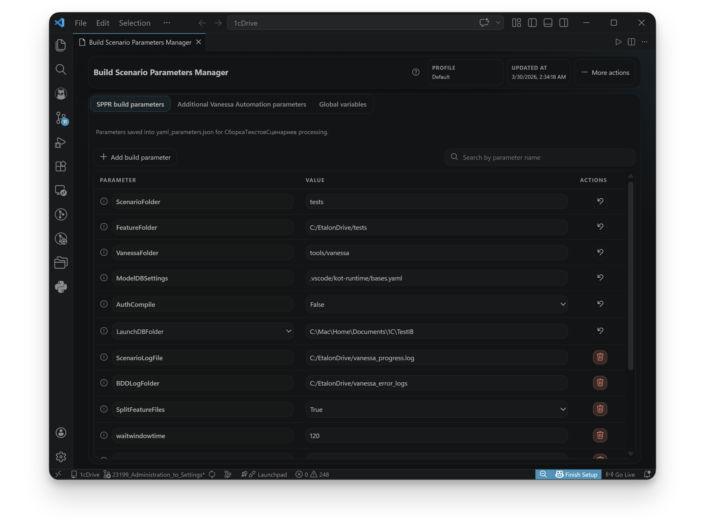

---
